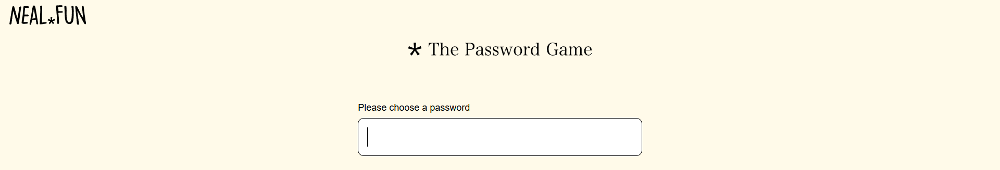
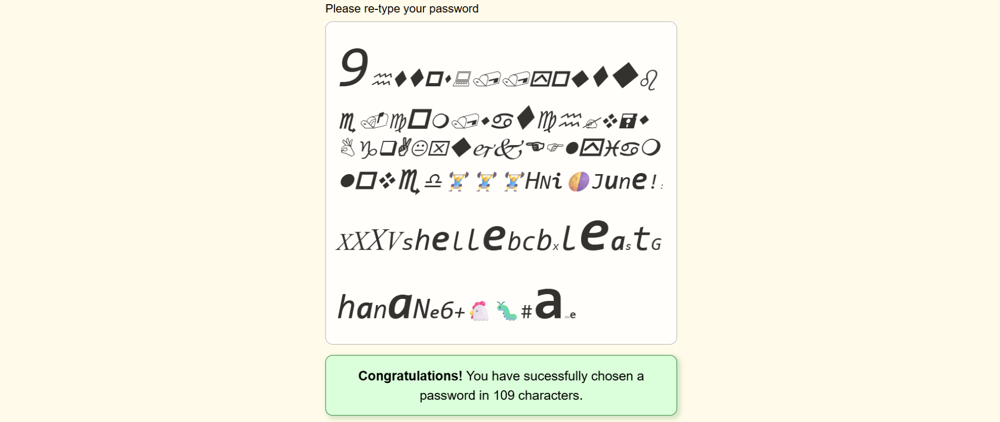

# The Password Game

If you've been keeping up with the Internet for the past few years, chances are that you might have come across "[The Password Game](https://neal.fun/password-game/)." It's a browser puzzle game created by Neal Agarwal.

The premise of the game is simple: create a password that follows all the given rules. This may seem easy at first since the game starts off with pretty standard rules that you'd expect in a regular password policy. However, the rules become increasingly strange and complicated as the game goes on, and everything quickly escalates into a wonderful chaotic mess.

The Password Game first came into my knowledge about a year ago and immediately piqued my interest. I played the game for myself, but I only made it to Rule 24 out of a total of 35 rules. Between the constant maintenance required for Rule 23 and the search for a suitable answer to Rule 24, I was unable to split my attention between the two. After several failed attempts, I eventually gave up. 

That was until a month ago, when I stumbled upon a [video](https://youtu.be/-osyW_rpoQs?si=ac6onb_5X4Ck7H-G) explaining the [strategies and resources](https://www.speedrun.com/The_Password_Game/guides/y022w) that speedrunners use to beat the game in seconds. That's when I realised that I could follow some of these strategies to beat the game myself. So, I finally decided to attempt the game once again, but this time, I was determined to beat it.

## How The Game Works

The player is given an input text field with the prompt: "Please choose a password." Once the player starts typing a password, the game introduces the first password rule. When the player enters a password that complies with this rule, the game reveals the second rule, and so on.

To progress, the player must choose a password that satisfies the current rule as well as all previously introduced rules. At times, attempting to follow a new rule may cause the password to break a previous one. In such cases, the player must revise the password to meet all rules up to that point.

There are a total of 35 rules that the final password must satisfy.

## Solving The Puzzle: Rule-By-Rule

### Rule 1: Your password must be at least 5 characters.
This part is easy. I also know that I’ll need to include a month in the password for a later rule based on previous failed attempts, so I chose "April."

### Rule 2: Your password must include a number.
I added "1" to the end of the password. Simple!

### Rule 3: Your password must include an uppercase letter.
The "A" in "April" is already capitalized, so it passes automatically.

### Rule 4: Your password must include a special character.
I added "!" to the end of the password.

### Rule 5: The digits in your password must add up to 25.
There's already a "1" in our password at this point, so I did some quick math and added "45555" to the end of the password.
> 1 + 4 + 5 + 5 + 5 + 5 = 25

### Rule 6: The password must include a month of the year.
I pre-solved this in Rule 1.

### Rule 7: Your password must include a roman numeral.
I added "XXXV" to the end of the password. I chose this specific number because I know the Roman numerals will need to multiply to 35 for a later rule.
> XXXV = 35

### Rule 8: Your password must include one of our sponsors: 🥤☕︎⛽
This rule tells us to include the name of one of the sponsors given. Out of the three choices Pepsi, Starbucks, and Shell, I chose Shell for no particular reason. I added "shell" to the end of the password.

### Rule 9: The roman numerals in your password should multiply to 35.
I pre-solved this in Rule 7.

### Rule 10: Your password must include this CAPTCHA: 🔣🗘
This rule tells us to include the response to the text-based CAPTCHA. Rule 5 states that all the digits in the password must add up to 25, so I was reluctant to add more numbers. I refreshed the CAPTCHA until I got one without any numbers. I added the CAPTCHA response "ebcbx" to the end of the password.

### Rule 11: Your password must include today's Wordle answer.
I paid a quick visit to The New York Times website to play Wordle. I played the game on 01 September 2025. The Wordle answer that day was "LEAST." I added "least" to the end of the password.

### Rule 12: Your password must include a two letter symbol from the periodic table.
I know that sodium is "Na" off the top of my head, so I added "Na" to the end of the password.

### Rule 13: Your password must include the current phase of the moon as an emoji.
I’ve always had trouble finding out the current phase of the moon. Different meteorological websites I checked often have conflicting answers, so I ended up brute-forcing this rule. I added the moon phase emojis one by one until I got it right.

### Rule 14: Your password must include the name of this country. 🗺️📍
This rule tells us to include the country given in the Google Street View / GeoGuessr. I'm not particularly good at GeoGuessr, so it took me quite a bit of scrolling and looking around until I found a sign that confirmed it was Ghana. I added "Ghana" to the end of the password.

### Rule 15: Your password must include a leap year.
Although the year technically "00" does not exist in Gregorian calendar, the game treats it as a leap year. I presume it’s because the program checks if a number is a leap year using the modulo operator. In any case, I added "00" to the end of the password.
> 💡 Including smaller numbers in the password helps keep it simple and reduces the likelihood of failure in later steps.

### Rule 16: Your password must include the best move in algebraic chess notation. 𖣯
This rule tells us to include the best move for the current position on the given chessboard in standard algebraic chess notation. The chess puzzles are not too difficult, but they can still be challenging if we're not familiar with playing chess. It did take me a moment to figure out, but I got it right eventually. I added "Ne6+" to the end of the password. Adding the number "6" to the password broke Rule 5 since the digits no longer add up to 25. So, I went back and changed the numbers in the beginning from "45555" to "4455".
> **Ne6+** — **Knight** moves to the **e6** square with a **check**  
> **N** — Knight — The piece to move  
> **e6** — File e, Rank 6 — The target square  
> **+** — Check

### Rule 17: 🥚 ← This is my chicken Paul. He hasn't hatched yet, please put him in your password and keep him safe.
I copied and pasted the egg emoji to the end of the password. Pretty simple!

### Rule 18: The elements in your password must have atomic numbers that add up to 200.
This rule accounts for all element symbols present in the password, whether they are one letter or two letters. In following previous rules, our current password included three element symbols: "V", "Ne", and "Na". I looked up the periodic table once again, calculated what other symbols will bring the total up to 200, and added "BaFm" to the beginning of the password.
> V — Vanadium = 23  
> Ne — Neon = 10  
> Na — Sodium = 11  
> Ba — Barium = 56  
> Fm — Fermium = 100  
> 23 + 10 + 11 + 56 + 100 = 200

### Rule 19: All the vowels in your password must be bolded.
While typing the solution to the previous rule, I accidentally made all characters bolded. So, this one passed automatically.

### Rule 20: Oh no! Your password is on fire. Quick, put it out!
The rule starts a fire (adds 🔥) at a random place in the password. The fire spreads quickly and burns away the adjacent characters (replaces the adjacent characters with 🔥). I moved quickly and put out the fire (deleted all 🔥) before it spread too much. Then, I had re-added the missing part of the password earlier.

### Rule 21: Your password is not strong enough 🏋️‍♂️
This rule tells us to add three 🏋️‍♂️ in the password. I added them to the beginning of the password.

### Rule 22: Your password must contain one of the following affirmations: I am loved, I am worthy, I am enough
I picked the first option just because, and I added "iamloved" to the beginning of the password. I also bolded the vowels to make sure the password does not break Rule 19.

### Rule 23: Paul has hatched! Please don't forget to feed him, he eats three 🐛 every minute.
Paul, previously 🥚 becomes a 🐔. We need to add 🐛 to the password to feed him. One 🐛 disappears every 20 seconds. If we run out of 🐛 in the password, Paul starves. If we add too many, Paul gets overfed. I added about six 🐛 to the password, which gives me roughly 2 minutes to work on other things before I have to add more. This rule, in my opinion, is the most challenging rule of the game, since it effectively adds a timer that we constantly have to maintain, and the time pressure significantly affects our ability to tackle other rules.
> 💡 It's unclear exactly how many 🐛 will overfeed Paul. There's a delay before the Game Over screen appears, but in my testing, 6 is safe. At around 7 or 8, Paul gets overfed.

### Rule 24: Your password must include the URL of a 11 minute 57 second long YouTube video.
This rule is one of the most problematic rules in the game. It is already difficult enough to find a YouTube video with the exact length specified in the rule, but it also introduces a whole bunch of characters and numbers that interfere with the previous rules. Combined with the time pressure from Rule 23, it becomes really challenging to get past this rule.I’ve tried finding YouTube videos with the specified lengths on my own in the past, but I wasn’t very successful. So this time around, I used the URLs provided in this [spreadsheet](https://drive.google.com/file/d/12A2Og_CD6IMQMwbWyb3tLVW0AAmLHG7g/view?usp=drivesdk), which include URLs for the all possible video lengths. I added the URL "`https://youtube.com/watch?v=wBgqAKxujkEFly`" to the beginning of the password. This broke Rule 18 since the URL contains the element symbols "B", "K", "Fl", and "Y". I changed the previously added element symbols "Ba", "Fm", and "Na" to "H" and "Ni" to make sure the atomic numbers add up to 200. I was also able to change the uppercase "Y" into a lowercase "y" so that it no longer counts as an element symbol.
> V — Vanadium = 23  
> Ne — Neon = 10  
> B — Boron = 5  
> K — Potassium = 19  
> Fl — Flerovium = 114  
> H — Hydrogen = 1  
> Ni — Nickel = 28  
> 23 + 10 + 5 + 19 + 114 + 1 + 28 = 200

### Rule 25: A sacrifice must be made. Pick 2 letters that you will no longer be able to use. ⌨
Any letters we choose here can no longer be included in our password. I took some time to check whether each letter of the alphabet appears in our current password, and found that "z" is the only character that doesn't appear at least once. I then changed the month in the password from "April" to "June" to also free up the letter "r". I picked "r" and "z" as sacrifices.

### Rule 26: Your password must contain twice as many italic characters as bold.
To make sure that less than one-third of total characters are bold, I made it so that only the vowels are bold. Then, I changed the rest of the characters to italic. However, that was still not enough, so I ended up changing all characters to italic.

### Rule 27: At least 30% of your password must be in Wingdings font.
Changing the characters to Wingdings font will turn them into a bunch of symbols and make them very difficult to read. I figured that the first portion of our current password would not need additional changes for the upcoming rules, so I changed those characters to Wingdings font.

### Rule 28: Your password must include this color in hex. ◼️
I inspected the CSS code of the website and found the RGB values of the specified color, which converted to hex code "#1a222e". I added it to the end of the password and bolded the "a" and "e". I also had to adjust the digits in the password to make sure that they add up to 25. I deleted the "1" after "June" and changed the other digits for "4455" to "435".
> 1 + 2 + 2 + 2 + 4 + 3 + 5 + 6 = 25

### Rule 29: All roman numerals must be in Times New Roman.
I changed the font of "XXXV" to Times New Roman.

### Rule 30: The font size of each digit must be equal to its square.
This rule isn’t complicated but is a bit tedious. I changed the font size of each digit to be the square of its value.

### Rule 31: Every instance of the same letter must have a different font size.
Another very tedious rule. I switched the first part of the password from Wingdings font back to a readable font so I could see the characters. Then, I went through the password character by character from left to right, and changed the font size of duplicate characters to be different from the previous ones.

### Rule 32: Your password must include the length of your password.
This rule is a tricky one since the length of the password is always changing as more characters get added and the chicken eats more caterpillars. I decided to go with 108 for the time being since that was about how long the current password was. To add more digits, I had to delete a "4" and a "5" that I added previously. I added "108" to the end of the password while making sure that each digit has the font size of the square of its value.

### Rule 33: The length of your password must be a prime number.
The closest and most convenient prime number to the current length of the password is 109. I can easily achieve this by adding a few more caterpillars to the password. I changed the length of the password I added for the previous rule from "108" to "109". I also changed the "3" in the middle of the password to "2" to make sure the digits still add up to 25. Then, I added some caterpillars to match the 109-character length, and formatted the password to comply with Rule 30.

### Rule 34: Uhhh let's skip this one.
This rule automatically passes.

### Rule 35: Your password must include the current time.
By the time I got to this rule, it was around 12 o'clock at noon. Including the real time would require a lot of messing around with the numbers that are already in the password, so I decided to work around this by changing the system's clock. I changed the time to 12:55 am. This gave me enough time to fix the rest of the password while I waited for it to turn 1:01 am.I added '1:01' to the password and deleted the '2' that was in the middle of the password. I formatted the digits so that they comply with Rule 30, and maintained the exact number of caterpillars so the password length stayed at 109. When the clock ticked 1:01 am, I passed this final rule.

### Please re-type your password
After passing the final rule, the game asks, "Is this your final password?" If we answer "Yes", it will ask us to re-type the password. We can still see our password, but we can no longer select or copy it. I knew about this ahead of time, so I made a copy of the final password in a text file as a backup. However, I forgot that it would not retain the format of the password. I copied and pasted the password I had saved in the text file and attempted to match the format of the original password shown on screen. This proved to be quite impossible due to the different fonts and font sizes. I tried for about 30 minutes but did not manage to match the original password. I was really frustrated with myself for not keeping the copied original password in the clipboard and was pretty much ready to restart. Before I committed to restarting, I decided to look through my notes and recordings one last time. Then I remembered I could inspect the website to check the exact formatting of each character in the original password, just like I did for the color rule. So, I inspected the webpage, checked the format of each character, and formatted the re-typed password character by character. Finally, after all that effort, I managed to get it right and officially beat the password game.

## The Final Password
This is the final password with no formatting.  
` 109https://youtube.com/watch?v=wBgqAKxujkEFlyiamloved🏋️‍♂️🏋️‍♂️🏋️‍♂️HNi🌗June!1:01XXXVshellebcbxleastGhana00Ne6+🐔🐛#1a222e0 `
